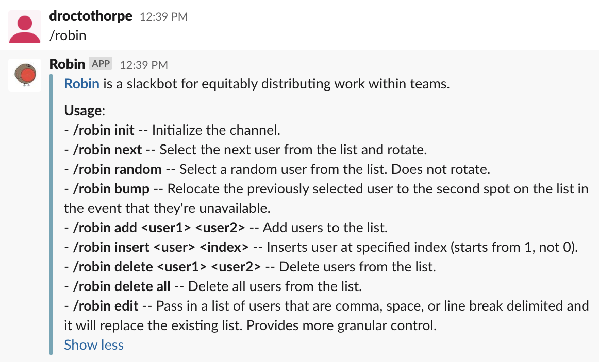

# Robin 

**Robin** is a slackbot that facilitates the equitable distribution of work within teams.  

It lets you round-robin through or randomly select from a list of pre-selected users directly within Slack. User lists are currently channel-scoped.  

Robin lets you administer the user list from directly within Slack so there's no need to interface with the application in any other context.

Here's a screenshot that illustrates usage:


It leverages slash commands for improved security.

Robin is open source. Contributions are welcome and appreciated. 

## Installation
We currently support a Heroku deployment. ECS is coming very soon. 

To deploy to Heroku:
```bash
git clone https://github.com/droctothorpe/robin.git
heroku login
heroku create robin-<insert custom name>
heroku addons:create heroku-postgresql:hobby-dev
heroku config:set FLASK_APP=robin.py
heroku config:set FLASK_CONFIG=heroku
heroku config:set SECRET_KEY=$(openssl rand -hex 12)
git push heroku master
heroku run flask deploy
heroku restart
```

Make note of the URL of your webserver.

## Slack Configuration
Navigate to https://api.slack.com/apps.

Click `Create New App`.

Name your application `Robin`, select the appropriate Slack workspace, then click `Create App`. 

Click `Slash Commands`.

Click `Create New Command`.

Set the `Command` field to `robin`. 

Set the `Request URL` to the **https** URL of the application that you just deployed to Heroku.

Set the `Short Description` to:
> Slackbot for the equitable distribution of work within teams.

Click `Save` in the lower right hand corner. 

Click on `Basic Information`. 

Scroll down to `Display Information`. 

Under `App Icon & Preview`, select `Add App Icon`. 

Select `logo.jpeg` from the application directory. 

Click `Save Changes` in the lower-right hand corner. 

Go to the specified Slack workspace and type `robin`. You should see a usage dialog. 

That's it!

## Local Development

Install Miniconda.
```bash
brew cask install miniconda
```

Create a new conda environment for Robin.
```bash
conda create -n robin -f requirements/local.txt -y
```

Activate the environment.
```bash
conda activate robin
```

Run the migration.
```bash
flask run deploy
```

Start the API.
```bash
flask run --cert=adhoc
```

Validate that the server is running.
```bash
open http://localhost:5000/health
```

To link the local application to your Slack channel for validation purposes, install ngrok.
```bash
brew install ngrok
```

Run ngrok.
```bash
ngrok http https://localhost:5000
```

Copy the `https` URL and use it as the backend for your slash command per the instructions [here](#slack-configuration).
